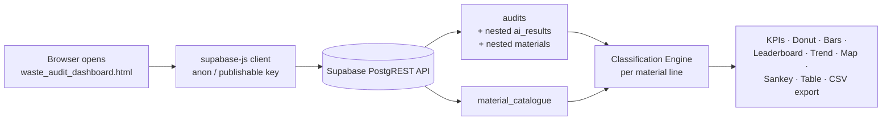

# 🗑️ Waste Audit BI — Executive Dashboard

A single-file, zero-backend BI dashboard for waste bin audits, built directly on **live Supabase data**.
Open `waste_audit_dashboard.html` in any browser — it connects to Supabase, classifies every audited
material against its *correct* waste stream, and turns raw audit records into decision-ready metrics:
recovery rates, contamination rates, missed CDS refunds, and site league tables.

**Stack:** Vanilla HTML/JS · [supabase-js v2](https://supabase.com/docs/reference/javascript) · [Apache ECharts 5](https://echarts.apache.org/) · [Leaflet](https://leafletjs.com/) (OpenStreetMap)

---

## 📚 Table of Contents

1. [How It Works](#-how-it-works)
2. [Data Model — Tables & Columns Used](#-data-model--tables--columns-used)
3. [The Classification Engine](#-the-classification-engine)
4. [Weight & Volume Estimation](#-weight--volume-estimation)
5. [KPI Reference](#-kpi-reference)
6. [Chart & Panel Reference](#-chart--panel-reference)
7. [Slicers & Interactivity](#-slicers--interactivity)
8. [Data Hygiene Rules](#-data-hygiene-rules)
9. [Assumptions & Caveats](#-assumptions--caveats)
10. [Setup & Configuration](#-setup--configuration)
11. [Troubleshooting](#-troubleshooting)

---

## 🏗 How It Works



There is **no backend**. The browser queries Supabase's auto-generated REST API directly using the
project's public (anon/publishable) key. **Row Level Security (RLS) is the only access control** —
see [Setup & Configuration](#-setup--configuration).

One nested query fetches everything in a single round trip:

```js
supabase.from('audits').select(`
  id, location, area, bin_type, bin_size, fullness_percentage,
  audit_date, auditor_name, status, setup, archived_at,
  latitude, longitude, created_at, number_of_auditors,
  ai_results (
    contamination_percentage, ai_confidence, summary, observations, confirmed_at,
    materials ( material_name, percentage )
  )
`)
```

plus one flat query on `material_catalogue`. Everything else — classification, kg/L math,
filtering, aggregation — happens client-side in JavaScript.

---

## 🗄 Data Model — Tables & Columns Used

Four tables feed the dashboard. Columns not listed here are fetched nowhere and displayed nowhere
(notably: `profiles.email` is deliberately **not** used — it is personal data and this dashboard can
run key-only and public).

### `audits` — one row per bin audit

| Column | Type | Used for |
|---|---|---|
| `id` | uuid | Row identity, table → detail-modal linking |
| `area` | text | **Site** dimension (leaderboard, slicer, sankey left nodes). Falls back to `location` when blank |
| `location` | text | Sub-site label, search, fallback for `area` |
| `bin_type` | text | Mapped to the audited **stream** (see mapping table below) |
| `bin_size` | text | Parsed for litres (`"240L"` → `240`) — volume & weight math |
| `fullness_percentage` | int | % of bin filled — volume & weight math (capped at 100) |
| `audit_date` | date | Date slicer, weekly trend, table |
| `setup` | int2 | Selects which `stream_setup{N}` column in the catalogue defines the *correct* stream |
| `status` | text | Hygiene filter (`draft` hidden by default) + status badge |
| `archived_at` | timestamptz | Informational — archived audits are **kept** (they hold most AI results) |
| `auditor_name` | text | Auditor dimension (normalised — see [Data Hygiene](#-data-hygiene-rules)) |
| `latitude`, `longitude` | float8 | Map markers |
| `created_at` | timestamptz | Date fallback when `audit_date` is null |
| `number_of_auditors` | int | Detail modal |

### `ai_results` — one AI analysis per audit (joined via `audit_id`)

| Column | Type | Used for |
|---|---|---|
| `contamination_percentage` | numeric | AI's own contamination estimate — table column, map marker colour, detail modal |
| `ai_confidence` | numeric | Detail modal |
| `confirmed_at` | timestamptz | "Confirmed AI results only" slicer; auditor QA tooltip |
| `summary`, `observations` | text | Detail modal narrative |

### `materials` — the composition lines (joined via `ai_result_id`)

| Column | Type | Used for |
|---|---|---|
| `material_name` | text | Joined **by name** (case-insensitive, trimmed) to `material_catalogue.name` |
| `percentage` | numeric | Share of the audited load this material represents |

### `material_catalogue` — reference data (52 materials)

| Column | Type | Used for |
|---|---|---|
| `name` | text | Join key from `materials.material_name` |
| `category` | text | Material grouping (Paper & Cardboard, Plastics, CDS, Organics, …) — sankey right nodes, modal pie |
| `density` | numeric | **Bulk density in g/L** — converts volume share to kilograms |
| `stream_setup1/2/3` | text | The **correct destination stream** for this material under site configuration 1/2/3 |

> ⚠️ `materials.material_name` → `material_catalogue.name` is a **text join**, not a foreign key.
> Renaming a catalogue entry breaks classification for older material lines. In verification against
> real data, 99/100 lines joined cleanly.

---

## ⚙️ The Classification Engine

This is the heart of the dashboard. Every material line (one material inside one audit) is
classified by comparing **where it was found** with **where it should have gone**.

### Step 1 — Where it was found: `bin_type` → stream

| `audits.bin_type` value | Stream |
|---|---|
| `general_waste` | General Waste |
| `mixed_recycling` | Mixed Recycling |
| `recycling` | Mixed Recycling *(assumption — see [Caveats](#-assumptions--caveats))* |
| `paper_cardboard` | Paper & Cardboard |
| `cds` | CDS |

### Step 2 — Where it should have gone: `setup` → `stream_setup{N}`

```
destination = catalogue.stream_setup{audit.setup}     -- setup ∈ {1,2,3}
            ?? catalogue.stream_setup2                -- fallback if null/None
            ?? catalogue.stream_setup1                -- final fallback
```

Example: *Glass Bottles* has `stream_setup1 = Mixed Recycling`, `stream_setup2 = CDS`.
Under setup 2 (the most common), a glass bottle's correct destination is the **CDS** stream.

### Step 3 — The decision table

| Condition | Classification | Colour | Meaning |
|---|---|---|---|
| destination = stream it was found in | ✅ **Correct** | 🟢 `#3F6B34` | Sorted correctly |
| destination = General Waste, found in a recycling stream | ❌ **Landfill contamination** | 🔴 `#C82C2C` | Non-recyclable polluting a recycling bin |
| destination = some recycling stream, found in a *different* recycling stream | ⚠️ **Cross-stream contamination** | 🟡 `#E0A400` | Recyclable, but in the wrong recycling bin |
| destination = CDS, found anywhere else | 🔵 **CDS / incorrect recycling** | 🔵 `#3B6E8F` | Refundable deposit containers not redeemed |
| destination = recycling stream, found in General Waste | ♻️ **Recyclables in general waste** | 🟩 `#2F8577` | Recoverable material lost to landfill |
| no catalogue match / destination `None` | **Unclassified** | ⚪ `#9AA097` | Not enough reference data |

```js
function classify(dest, stream){
  if (!dest || dest === 'None')      return 'unclassified';
  if (dest === stream)               return 'correct';
  if (dest === 'CDS')                return 'cds_missed';
  if (dest === 'General Waste')      return stream === 'General Waste' ? 'correct' : 'landfill';
  if (stream === 'General Waste')    return 'recoverable_gw';
  return 'cross_stream';
}
```

**"Contamination"** throughout the dashboard = `landfill + cross_stream + cds_missed`,
measured **within recycling streams** (General Waste can't be "contaminated" by definition —
misplaced recyclables there are tracked separately as *recoverables*).

---

## ⚖️ Weight & Volume Estimation

Audits record *percentages*, not weights. Weights are **estimated**, per material line:

```
bin_litres     = leading integer of audits.bin_size          -- "660L" → 660
fill_litres    = bin_litres × min(fullness_percentage, 100) / 100
material_L     = fill_litres × materials.percentage / 100
material_kg    = material_L × catalogue.density / 1000        -- density assumed g/L
```

**Worked example** — a 240 L mixed-recycling bin at 79% full containing 40% Paper (density 15 g/L):

```
fill_litres  = 240 × 0.79        = 189.6 L
material_L   = 189.6 × 0.40      = 75.8 L of paper
material_kg  = 75.8 × 15 / 1000  = 1.14 kg
```

- The **Weight (kg) / Volume (L)** toggle switches every metric between these two bases.
- Lines missing `bin_size`, `fullness_percentage`, or `density` contribute **0** to weight/volume
  totals (they still appear in the audit table). The coverage note under the slicers reports how
  many audits are "weighable".

---

## 📌 KPI Reference

### The calculation funnel — filters applied to *every* KPI

Every KPI (and every chart) is computed from **material lines** — one line per material per audit —
after passing through the same funnel, in this order:

```
70 audits loaded (ROW_LIMIT 1000)
 │
 ├─ 1. HYGIENE FILTER (on by default, reversible via toggle)
 │     ✗ status = 'draft'
 │     ✗ test rows: area/location/auditor_name matching
 │       test | ^x{3,}$ | ^zx{3,}$ | ghfdg | kfhcjg | ^hehe$ | ^fs$
 │     ✓ archived audits are KEPT (archiving = completion in this workflow)
 │
 ├─ 2. SLICERS (all default to "all")
 │     date From/To  → audit_date (falls back to created_at date)
 │     Site          → normalised area
 │     Stream        → mapped bin_type
 │     Auditor       → normalised auditor_name
 │     Confirmed AI results only → ai_results.confirmed_at is set
 │
 ├─ 3. LINE ELIGIBILITY (implicit, not toggleable)
 │     an audit contributes lines only if it has an ai_results row
 │     with materials attached — audits without AI data appear in
 │     the audits TABLE but contribute nothing to KPIs/charts
 │
 ├─ 4. VALUE BASIS (kg / L toggle)
 │     fullness capped at 100% for volume math
 │     lines missing bin_size, fullness, or catalogue density
 │     contribute 0 kg / 0 L (they still exist for the table/modal)
 │
 └─ 5. KPI-SPECIFIC SCOPE (last column of the table below)
```

The **coverage note** under the slicers reports the funnel live:
*"48 audits in view · 48 with AI material data · 48 weighable · 22 drafts/test audits hidden"* —
if "weighable" is lower than "in view", some audits are contributing 0 to weight-based figures.

> Auditor and site **normalisation** also affects any KPI grouped by those dimensions:
> `Marcela Mayer`/`Marcela ` → `Marcela Meyer`; `5 Martin Pl`/`5 Martin` → `5 Martin Place`.

### The KPIs

`Σ` = sum of `material_kg` (or `material_L`) over lines that survived steps 1–4.

| # | KPI | Formula | KPI-specific scope (step 5) | Source fields |
|---|---|---|---|---|
| 1 | **Total waste audited** | `Σ(all lines)` — subtitle shows L, kg and audit count | none — all surviving lines | `bin_size`, `fullness_percentage`, `materials.percentage`, `catalogue.density` |
| 2 | **Actual recycling rate** | `Σ(correct ∧ stream ≠ General Waste) ÷ Σ(all) × 100` | numerator: correctly-sorted lines in recycling streams only | + `bin_type`, `setup`, `stream_setup{N}` |
| 3 | **Potential recovery rate** | `Σ(destination ≠ General Waste) ÷ Σ(all) × 100` | numerator: *correct-in-recycling + cds_missed + recoverable_gw + cross_stream*; **unclassified lines are excluded** from the numerator (counted in the denominator) | same |
| 4 | **Recycling contamination** | `Σ(landfill + cross_stream + cds_missed) ÷ Σ(recycling-stream lines) × 100` | **both** numerator and denominator restricted to recycling streams — General Waste bins are excluded entirely | same |
| 5 | **Missed CDS containers** | `Σ(class = cds_missed)` | lines whose correct destination is CDS, found in any other stream | same |
| 6 | **Recyclables lost to general waste** | `Σ(class = recoverable_gw)` | recyclable lines found in General Waste bins only | same |

**Why #2 vs #3 matters:** the gap between *actual* and *potential* is the entire improvement
opportunity. Verified against the real dataset (default filters): **55.2 kg audited → 40% actual,
75% potential** — meaning correct sorting alone would nearly double diversion from landfill.

### Chart-level scopes (same funnel, plus:)

| Chart | Extra scope beyond steps 1–4 |
|---|---|
| Contamination vs Recyclability panel | active **stream tab**; donut-segment click filters the material list to one classification |
| Site leaderboard | **recycling streams only** (contamination is undefined for General Waste); sites with 0 recycling-stream weight are omitted |
| Trend | contamination line: recycling streams only; recovery line: all streams |
| Audits per auditor | audit-level (step 3 not applied — audits without AI data still count toward the bar) |
| Map | only audits with non-null `latitude`/`longitude` |
| Sankey | lines with value > 0 in the current unit |
| Audits table | audit-level — shows **all** audits surviving steps 1–2, including those with no AI data (their weight shows "—") |

---

## 📊 Chart & Panel Reference

### 1. Contamination vs Recyclability *(hero panel)*

| Element | What it shows | Source |
|---|---|---|
| **Stream tabs** | All / General Waste / Mixed Recycling / Paper & Cardboard / CDS — scopes the whole panel | `bin_type` |
| **Donut** | Share of each classification, total kg/L in the centre | classification engine |
| **Legend** | Classification shares as % | same |
| **Material bars** | Top 12 materials by weight/volume, bar coloured by the material's *dominant* classification, label = % of tab total | `materials.material_name`, `percentage` |
| **Key metrics strip** | CDS share · misplaced organics · landfill contam. · cross-stream · correct — each with kg/L subtext | classification engine |

**Interaction:** click a donut segment → the material list filters to that classification
(click again to clear). Mirrors the reference "Bin Vision" breakdown layout.

### 2. Site Leaderboard — Contamination Rate

Ranked horizontal bars, one per site (`area`, normalised), showing
`contaminated ÷ total within recycling streams × 100`. Bar colour encodes severity
(<10% green · 10–25% amber · >25% red). **Click a bar to filter the entire dashboard to
that site** (click again to clear). Tooltip shows kg/L behind the rate.

### 3. Trend — Contamination & Recovery *(weekly)*

Two lines by ISO week of `audit_date`: **contamination rate** (recycling streams) and
**recovery rate** (`correct-in-recycling ÷ total`). Answers "are the interventions working
between audit rounds?"

### 4. Audits per Auditor

Horizontal bars of audit counts per (normalised) `auditor_name`. Tooltip adds the QA angle:
how many of that auditor's AI results are human-confirmed (`ai_results.confirmed_at`).

### 5. Audit Locations *(map)*

Leaflet/OpenStreetMap markers from `latitude`/`longitude`; marker colour = AI
`contamination_percentage` severity. Popup: site, stream, contamination, date.
Only audits with coordinates appear.

### 6. Waste Stream Composition by Area *(sankey)*

Flows from **site** (left, `area` with `location` fallback) to **material category**
(right, `catalogue.category`), flow width = kg/L. Own colour legend on the left.
Click a site node to filter the dashboard.

### 7. Audits Table + Detail Modal

Searchable table (date, site, location, stream, bin, fullness, estimated weight, AI
contamination, status badge, auditor). Click any row → modal with full audit fields, AI
summary/observations, and a **materials pie coloured by classification**.

### 8. Export CSV

Downloads the currently-filtered material lines — one row per material per audit with
site, stream, material, category, %, est. kg, est. L, classification, confirmed flag and
auditor. Ready for Excel or further analysis.

---

## 🎛 Slicers & Interactivity

| Control | Effect |
|---|---|
| **From / To** (date) | Filters on `audit_date` (falls back to `created_at` date) |
| **Site / area** | Filters on normalised `area` |
| **Stream** | Filters on mapped `bin_type` |
| **Auditor** | Filters on normalised `auditor_name` |
| **Weight (kg) / Volume (L)** | Switches the base of *every* metric and chart |
| **Confirmed AI results only** | Keeps only material lines whose `ai_results.confirmed_at` is set |
| **Include drafts / test data** | Reveals rows hidden by the hygiene rules below |
| Donut segment · site bar · sankey node | Cross-filtering (see chart reference) |
| **Refresh / Auto-refresh (60s)** | Re-queries Supabase — the dashboard is always live |

A **coverage note** under the slicers always states how many audits are in view, how many have AI
material data, how many are weighable, and how many rows the hygiene rules are hiding — so nobody
is misled about the evidence base.

---

## 🧹 Data Hygiene Rules

Real-world audit data contains drafts, tests and typos. Defaults (all reversible via the
*Include drafts / test data* toggle, or editable in the code):

| Rule | Detail |
|---|---|
| **Drafts hidden** | `status = 'draft'` excluded by default |
| **Test rows hidden** | `area`, `location` or `auditor_name` matching `test`, `xxx…`, `ghfdg`, `kfhcjg`, `hehe`, `fs` |
| **Archived audits kept** | `archived_at` is *not* an exclusion — verified: archived audits carry ~13 of 14 AI analyses in the dataset; archiving = completion in this workflow |
| **Fullness capped at 100%** | One real record shows 120%; capped for volume math only |
| **Auditor aliases merged** | e.g. `Marcela Mayer` / `Marcela ` → `Marcela Meyer`; `Binayak` variants → `Binayak Raj Khadka` (conservative, hardcoded list — the durable fix is app-side validation) |
| **Site aliases merged** | `5 Martin Pl` / `5 Martin` / `5 martin pl` → `5 Martin Place` |

---

## 📐 Assumptions & Caveats

1. **Density is bulk density in g/L.** Catalogue values (Glass Bottles = 111, Steel = 73,
   Cardboard = 20) only make physical sense as loose bulk densities. If your team measures
   differently, correct the single conversion in `buildLines()`.
2. **`bin_type = "recycling"` is treated as Mixed Recycling.** 3 audits carry this legacy value.
3. **Weights are estimates**, not weighbridge readings — composition %, fullness and density are
   all approximations. Treat kg figures as decision-grade, not billing-grade.
4. **Missing setup falls back to setup 2** (68 of 70 real audits are setup 2).
5. **Text join on material names** — see the warning in the data-model section.
6. **`ROW_LIMIT` is 1000 audits** per fetch. Raise it in `CONFIG`, or move aggregation into a
   Postgres view/RPC once the table outgrows browser-side crunching.

---

## 🚀 Setup & Configuration

### 1. Configure credentials

At the top of the `<script>` block in `waste_audit_dashboard.html`:

```js
const CONFIG = {
  SUPABASE_URL: 'https://YOUR-PROJECT-REF.supabase.co',
  SUPABASE_ANON_KEY: 'sb_publishable_...',   // or the legacy anon JWT
  ROW_LIMIT: 1000,
  AUTO_REFRESH_MS: 60000,
};
```

Both key formats work: the newer **publishable key** (`sb_publishable_…`, from
*Settings → API Keys*) or the **legacy anon JWT**. These keys are designed to be shipped to
browsers — but that makes RLS your only lock. 🔑

> ⚠️ **Before committing this repo publicly:** the anon/publishable key in the HTML will be
> visible to anyone. That is by design *only if* your RLS policies expose nothing sensitive.
> Review them first.

### 2. RLS read policies

The dashboard needs `SELECT` for the `anon` role on four tables:

```sql
create policy "public read" on public.audits             for select to anon using (true);
create policy "public read" on public.ai_results         for select to anon using (true);
create policy "public read" on public.materials          for select to anon using (true);
create policy "public read" on public.material_catalogue for select to anon using (true);
```

Scope the `using (…)` clause tighter (e.g. exclude drafts server-side) if the dashboard is public.

### 3. Run it

No build step. Open the file in a browser, or host it anywhere static (GitHub Pages, Netlify,
an S3 bucket). Requires internet access for the CDN libraries and the Supabase API.

> **Note for Claude.ai users:** the in-chat artifact preview blocks outbound network calls —
> the dashboard must be downloaded and opened in a normal browser tab.

---

## 🔧 Troubleshooting

| Symptom | Likely cause | Fix |
|---|---|---|
| `Invalid API key` (HTTP 401) | Malformed/wrong key (watch for copy artifacts — the prefix is `sb_publishable_`, one "s") | Re-copy from *Settings → API Keys* |
| Connected, but **0 audits / empty panels** | RLS allows the query but a policy filters all rows, or the table is empty, or slicers exclude everything | Check Table Editor for data; check policies; press *Include drafts / test data* |
| One panel says *"No data returned for `<table>`"* | Missing `SELECT` policy on that specific table | Add the policy from step 2 |
| `Could not embed because more than one relationship was found` | Multiple FKs between `audits`/`ai_results`/`materials` | Pin the FK name in the nested `select()` |
| Weights show `—` for some audits | Missing `bin_size`, `fullness_percentage`, or catalogue `density` | Fill the source data; coverage note shows the weighable count |
| Everything fails with `DataCloneError` / `Failed to fetch` | Running inside a sandboxed preview (e.g. Claude artifacts) | Open the file in a standalone browser tab |

---

*Weights are estimated from bin volume × fullness × material % × catalogue density. Figures are
decision-support estimates, not certified weighbridge measurements.*
